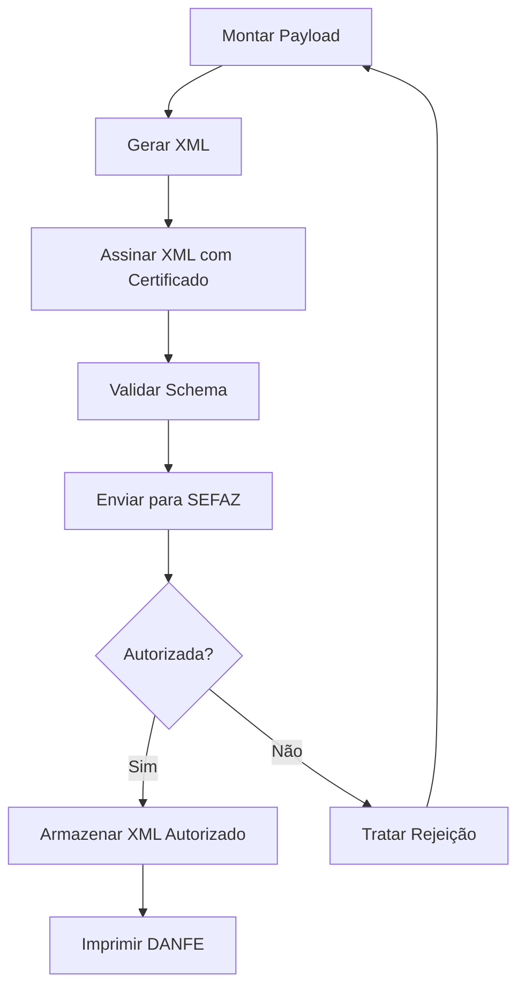

# 📋 Estrutura do Payload XML - NF-e/NFC-e

Este documento explica cada parte do payload que monta o XML da Nota Fiscal Eletrônica (NF-e) e Nota Fiscal de Consumidor Eletrônica (NFC-e) conforme o layout oficial da SEFAZ.

---

## 📑 Índice

1. [IDE - Identificação da Nota Fiscal](#1-ide---identificação-da-nota-fiscal)
2. [EMIT - Dados do Emitente](#2-emit---dados-do-emitente)
3. [AUTXML - Pessoas Autorizadas](#3-autxml---pessoas-autorizadas-a-acessar-o-xml)
4. [DET - Detalhamento dos Produtos](#4-det---detalhamento-dos-produtosserviços)
5. [TOTAL - Totalizadores](#5-total---totalizadores-da-nota)
6. [TRANSP - Transporte](#6-transp---transporte)
7. [PAG - Pagamento](#7-pag---pagamento)
8. [INFADIC - Informações Adicionais](#8-infadic---informações-adicionais)
9. [INFNFESUPL - Informações Suplementares](#9-infnfesupl---informações-suplementares-nfc-e)
10. [SIGNATURE - Assinatura Digital](#10-signature---assinatura-digital)

---

## 1. IDE - Identificação da Nota Fiscal

**Descrição:** Informações gerais e obrigatórias que identificam a nota fiscal.

### Campos:

| Campo | Descrição | Exemplo | Obrigatório |
|-------|-----------|---------|-------------|
| `cUF` | Código da UF do emitente do documento fiscal | `35` (SP) | ✅ Sim |
| `cNF` | Código numérico que compõe a chave de acesso (8 dígitos) | `00000000` | ✅ Sim |
| `natOp` | Natureza da operação | `VENDA`, `DEVOLUÇÃO` | ✅ Sim |
| `mod` | Modelo do documento fiscal | `55` (NF-e), `65` (NFC-e) | ✅ Sim |
| `serie` | Série do documento fiscal | `1`, `0` | ✅ Sim |
| `nNF` | Número da nota fiscal | `123456` | ✅ Sim |
| `dhEmi` | Data e hora de emissão | `2025-12-09T10:30:00-03:00` | ✅ Sim |
| `tpNF` | Tipo de operação | `0` (Entrada), `1` (Saída) | ✅ Sim |
| `idDest` | Identificador de local de destino | `1` (Interna), `2` (Interestadual), `3` (Exterior) | ✅ Sim |
| `cMunFG` | Código do município do fato gerador (IBGE) | `3550308` (São Paulo) | ✅ Sim |
| `cMunFGIBS` | Código do município para IBS/CBS | `3550308` | ⚠️ Reforma Tributária |
| `tpImp` | Formato de impressão do DANFE | `1` (Retrato), `4` (NFC-e) | ✅ Sim |
| `tpEmis` | Tipo de emissão | `1` (Normal), `9` (Contingência) | ✅ Sim |
| `cDV` | Dígito verificador da chave de acesso | `0-9` | ✅ Sim |
| `tpAmb` | Tipo de ambiente | `1` (Produção), `2` (Homologação) | ✅ Sim |
| `finNFe` | Finalidade de emissão | `1` (Normal), `2` (Complementar), `3` (Ajuste), `4` (Devolução) | ✅ Sim |
| `indFinal` | Operação com consumidor final | `0` (Não), `1` (Sim) | ✅ Sim |
| `indPres` | Indicador de presença do comprador | `1` (Presencial), `2` (Internet), `3` (Teleatendimento), `4` (NFC-e entrega) | ✅ Sim |
| `procEmi` | Processo de emissão | `0` (App próprio), `1` (Avulsa portal), `2` (Avulsa fisco), `3` (Contribuinte) | ✅ Sim |
| `verProc` | Versão do aplicativo emissor | `1.0` | ✅ Sim |

### Grupos Especiais:

#### `gCompraGov` - Compras governamentais
| Campo | Descrição |
|-------|-----------|
| `tpEnteGov` | Tipo de ente governamental |
| `pRedutor` | Percentual redutor |
| `tpOperGov` | Tipo de operação governamental |

#### `gPagAntecipado` - Pagamento antecipado
| Campo | Descrição |
|-------|-----------|
| `refNFe` | Referência da NF-e |

---

## 2. EMIT - Dados do Emitente

**Descrição:** Informações da empresa ou pessoa física que está emitindo a nota fiscal.

### Campos Principais:

| Campo | Descrição | Exemplo | Obrigatório |
|-------|-----------|---------|-------------|
| `CNPJ` | CNPJ do emitente | `00000000000000` | ✅ Sim |
| `xNome` | Razão social | `Empresa XYZ LTDA` | ✅ Sim |
| `xFant` | Nome fantasia | `Loja XYZ` | ❌ Não |
| `IE` | Inscrição Estadual | `123456789` | ✅ Sim (com exceções) |
| `CRT` | Código de Regime Tributário | `1`, `2`, `3` | ✅ Sim |

**Valores de CRT:**
- `1` - Simples Nacional
- `2` - Simples Nacional - excesso de sublimite de receita bruta
- `3` - Regime Normal

### `enderEmit` - Endereço do Emitente:

| Campo | Descrição | Exemplo | Obrigatório |
|-------|-----------|---------|-------------|
| `xLgr` | Logradouro (rua, avenida, etc) | `Rua das Flores` | ✅ Sim |
| `nro` | Número | `123` | ✅ Sim |
| `xBairro` | Bairro | `Centro` | ✅ Sim |
| `cMun` | Código do município (IBGE) | `3550308` | ✅ Sim |
| `xMun` | Nome do município | `São Paulo` | ✅ Sim |
| `UF` | Sigla da UF | `SP` | ✅ Sim |
| `CEP` | CEP | `01000000` | ✅ Sim |
| `cPais` | Código do país | `1058` (Brasil) | ✅ Sim |
| `xPais` | Nome do país | `BRASIL` | ✅ Sim |
| `fone` | Telefone | `1133334444` | ❌ Não |

---

## 3. AUTXML - Pessoas Autorizadas a Acessar o XML

**Descrição:** Define quem pode fazer download do XML da nota na SEFAZ.

| Campo | Descrição | Exemplo |
|-------|-----------|---------|
| `CNPJ` ou `CPF` | Documento da pessoa autorizada | `00000000000000` |

> 💡 **Dica:** Geralmente inclui-se o próprio emitente, contador e transportadora.

---

## 4. DET - Detalhamento dos Produtos/Serviços

**Descrição:** Detalha cada item (produto ou serviço) da nota fiscal.

### 4.1 `prod` - Dados do Produto

| Campo | Descrição | Exemplo | Obrigatório |
|-------|-----------|---------|-------------|
| `cProd` | Código interno do produto | `0001` | ✅ Sim |
| `cean` | Código de barras GTIN/EAN | `7891234567890` ou `SEM GTIN` | ✅ Sim |
| `xProd` | Descrição do produto | `CAMISETA ALGODÃO TAM M` | ✅ Sim |
| `NCM` | Nomenclatura Comum do Mercosul | `61091000` | ✅ Sim |
| `CFOP` | Código Fiscal de Operações | `5102` | ✅ Sim |
| `uCom` | Unidade comercial | `UN`, `KG`, `CX`, `LT` | ✅ Sim |
| `qCom` | Quantidade comercial | `1.0000` | ✅ Sim |
| `vUnCom` | Valor unitário comercial | `50.00` | ✅ Sim |
| `vProd` | Valor total do produto | `50.00` | ✅ Sim |
| `cEANTrib` | Código de barras tributável | `7891234567890` | ✅ Sim |
| `uTrib` | Unidade tributável | `UN` | ✅ Sim |
| `qTrib` | Quantidade tributável | `1.0000` | ✅ Sim |
| `vUnTrib` | Valor unitário tributável | `50.00` | ✅ Sim |
| `indTot` | Compõe total da NF | `1` (Sim), `0` (Não) | ✅ Sim |

**CFOPs Comuns:**
- `5102` - Venda de mercadoria adquirida ou recebida de terceiros
- `5405` - Venda de mercadoria adquirida ou recebida de terceiros em operação com mercadoria sujeita ao regime de substituição tributária
- `6102` - Venda de mercadoria adquirida ou recebida de terceiros (Interestadual)

---

### 4.2 `imposto` - Tributos do Produto

#### 🔷 ICMS - Imposto sobre Circulação de Mercadorias e Serviços

**Grupo:** `ICMS00` (Tributado integralmente)

| Campo | Descrição | Exemplo |
|-------|-----------|---------|
| `orig` | Origem da mercadoria | `0` a `8` |
| `CST` | Código da Situação Tributária | `00`, `10`, `20`, etc |
| `modBC` | Modalidade da base de cálculo | `0` a `3` |
| `vBC` | Valor da base de cálculo | `100.00` |
| `pICMS` | Alíquota do ICMS (%) | `18.00` |
| `vICMS` | Valor do ICMS | `18.00` |

**Valores de Origem (orig):**
- `0` - Nacional, exceto as indicadas nos códigos 3, 4, 5 e 8
- `1` - Estrangeira - Importação direta, exceto a indicada no código 6
- `2` - Estrangeira - Adquirida no mercado interno, exceto a indicada no código 7
- `3` - Nacional, mercadoria ou bem com Conteúdo de Importação superior a 40% e inferior ou igual a 70%
- `4` - Nacional, cuja produção tenha sido feita em conformidade com os processos produtivos básicos
- `5` - Nacional, mercadoria ou bem com Conteúdo de Importação inferior ou igual a 40%
- `6` - Estrangeira - Importação direta, sem similar nacional, constante em lista de Resolução CAMEX e gás natural
- `7` - Estrangeira - Adquirida no mercado interno, sem similar nacional, constante em lista de Resolução CAMEX e gás natural
- `8` - Nacional, mercadoria ou bem com Conteúdo de Importação superior a 70%

**CSTs Comuns:**
- `00` - Tributada integralmente
- `10` - Tributada e com cobrança do ICMS por substituição tributária
- `20` - Com redução de base de cálculo
- `30` - Isenta ou não tributada e com cobrança do ICMS por substituição tributária
- `40` - Isenta
- `41` - Não tributada
- `60` - ICMS cobrado anteriormente por substituição tributária

---

#### 🔷 PIS - Programa de Integração Social

**Grupo:** `PISAliq` (PIS com alíquota)

| Campo | Descrição | Exemplo |
|-------|-----------|---------|
| `CST` | Código da Situação Tributária | `01`, `02`, etc |
| `vBC` | Base de cálculo | `100.00` |
| `pPIS` | Alíquota do PIS (%) | `1.65` |
| `vPIS` | Valor do PIS | `1.65` |

**CSTs Comuns:**
- `01` - Operação Tributável com Alíquota Básica
- `02` - Operação Tributável com Alíquota Diferenciada
- `04` - Operação Tributável Monofásica - Revenda a Alíquota Zero
- `06` - Operação Tributável a Alíquota Zero
- `07` - Operação Isenta da Contribuição
- `08` - Operação sem Incidência da Contribuição
- `09` - Operação com Suspensão da Contribuição

---

#### 🔷 COFINS - Contribuição para Financiamento da Seguridade Social

**Grupo:** `COFINSAliq` (COFINS com alíquota)

| Campo | Descrição | Exemplo |
|-------|-----------|---------|
| `CST` | Código da Situação Tributária | `01`, `02`, etc |
| `vBC` | Base de cálculo | `100.00` |
| `pCOFINS` | Alíquota do COFINS (%) | `7.60` |
| `vCOFINS` | Valor do COFINS | `7.60` |

> 📌 **Nota:** Os CSTs do COFINS seguem a mesma tabela do PIS.

---

#### 🔷 IS - Imposto Seletivo (Novo)

| Campo | Descrição | Exemplo |
|-------|-----------|---------|
| `CSTIS` | Código da Situação Tributária | `41` |
| `cClassTribIS` | Classe de tributação | `00000000` |

> ⚠️ **Atenção:** Imposto novo aplicado a produtos específicos (bebidas, cigarros, veículos, etc).

---

#### 🔷 IBSCBS - IBS e CBS (Reforma Tributária)

**Descrição:** Impostos que substituirão ICMS, ISS, PIS e COFINS na Reforma Tributária.

**Estrutura:**

```javascript
IBSCBS: {
  CST: "01",
  cClassTrib: "00000000",
  indDoacao: "0",
  gIBSCBS: {
    vBC: "0.00",
    gIBSUF: {
      pIBSUF: "0.00",      // Alíquota IBS UF
      vIBSUF: "0.05"        // Valor IBS UF
    },
    gIBSMun: {
      pIBSMun: "0.00",     // Alíquota IBS Municipal
      vIBSMun: "0.00"       // Valor IBS Municipal
    },
    vIBS: "0.05",           // Valor total IBS
    gCBS: {
      pCBS: "0.00",         // Alíquota CBS
      vCBS: "0.00"          // Valor CBS
    }
  }
}
```

**Componentes:**
- **IBS (Imposto sobre Bens e Serviços):** Substitui ICMS e ISS
  - **IBSUF:** Parcela estadual
  - **IBSMun:** Parcela municipal
- **CBS (Contribuição sobre Bens e Serviços):** Substitui PIS e COFINS

---

### 4.3 `vItem` - Valor do Item

| Campo | Descrição |
|-------|-----------|
| `vItem` | Valor total do item (após descontos e acréscimos) |

---

## 5. TOTAL - Totalizadores da Nota

**Descrição:** Resume todos os valores da nota fiscal.

### 5.1 `ICMSTot` - Totais dos Tributos

| Campo | Descrição | Exemplo |
|-------|-----------|---------|
| `vBC` | Base de cálculo do ICMS | `100.00` |
| `vICMS` | Valor total do ICMS | `18.00` |
| `vICMSDeson` | Valor do ICMS desonerado | `0.00` |
| `vFCP` | Valor do Fundo de Combate à Pobreza | `0.00` |
| `vBCST` | Base de cálculo ICMS ST | `0.00` |
| `vST` | Valor ICMS Substituição Tributária | `0.00` |
| `vFCPST` | Valor FCP retido por ST | `0.00` |
| `vFCPSTRet` | Valor FCP retido anteriormente por ST | `0.00` |
| `vProd` | **Valor total dos produtos/serviços** | `100.00` |
| `vFrete` | Valor do frete | `0.00` |
| `vSeg` | Valor do seguro | `0.00` |
| `vDesc` | Valor de desconto | `0.00` |
| `vII` | Valor Imposto de Importação | `0.00` |
| `vIPI` | Valor total do IPI | `0.00` |
| `vIPIDevol` | Valor IPI devolvido | `0.00` |
| `vPIS` | Valor total do PIS | `1.65` |
| `vCOFINS` | Valor total do COFINS | `7.60` |
| `vOutro` | Outras despesas acessórias | `0.00` |
| `vNF` | 💰 **VALOR TOTAL DA NOTA FISCAL** | `109.25` |

> 🧮 **Cálculo do vNF:** `vProd - vDesc + vST + vFrete + vSeg + vOutro + vII + vIPI`

---

### 5.2 `IBSCBSTot` - Totais IBS/CBS (Reforma Tributária)

| Campo | Descrição |
|-------|-----------|
| `vBCIBSCBS` | Base de cálculo do IBS/CBS |
| `gIBS.gIBSUF.vIBSUF` | Valor IBS da UF |
| `gIBS.gIBSMun.vIBSMun` | Valor IBS do Município |
| `gIBS.vIBS` | Valor total do IBS |
| `gCBS.vCBS` | Valor total do CBS |
| `vNFTot` | Valor total da NF (com IBS/CBS) |

---

## 6. TRANSP - Transporte

**Descrição:** Informações sobre o transporte da mercadoria.

| Campo | Descrição | Valores |
|-------|-----------|---------|
| `modFrete` | Modalidade do frete | `0` - Emitente<br>`1` - Destinatário<br>`2` - Terceiros<br>`9` - Sem frete |

### Campos Opcionais:

- `transporta` - Dados da transportadora (CNPJ, nome, endereço)
- `veicTransp` - Dados do veículo (placa, UF, RNTC)
- `reboque` - Dados dos reboques
- `vol` - Volumes transportados (quantidade, espécie, marca, peso)

---

## 7. PAG - Pagamento

**Descrição:** Formas de pagamento da nota fiscal.

### `detPag` - Detalhamento do Pagamento

| Campo | Descrição | Exemplo |
|-------|-----------|---------|
| `tPag` | Forma de pagamento | Ver tabela abaixo |
| `vPag` | Valor do pagamento | `100.00` |

**Formas de Pagamento (tPag):**
- `01` - Dinheiro
- `02` - Cheque
- `03` - Cartão de Crédito
- `04` - Cartão de Débito
- `05` - Crédito Loja
- `10` - Vale Alimentação
- `11` - Vale Refeição
- `12` - Vale Presente
- `13` - Vale Combustível
- `15` - Boleto Bancário
- `16` - Depósito Bancário
- `17` - Pagamento Instantâneo (PIX)
- `18` - Transferência bancária, Carteira Digital
- `19` - Programa de fidelidade, Cashback, Crédito Virtual
- `90` - Sem pagamento
- `99` - Outros

### Campos Adicionais para Cartão:

- `card.tpIntegra` - Tipo de integração (`1` - Integrada, `2` - Não integrada)
- `card.CNPJ` - CNPJ da credenciadora
- `card.tBand` - Bandeira do cartão (01-Visa, 02-Mastercard, etc)
- `card.cAut` - Código de autorização

---

## 8. INFADIC - Informações Adicionais

**Descrição:** Campo livre para informações complementares.

| Campo | Descrição | Exemplo |
|-------|-----------|---------|
| `infCpl` | Informações complementares de interesse do contribuinte | `Pedido: 12345\nVendedor: João` |
| `infAdFisco` | Informações adicionais de interesse do Fisco | `Informações fiscais específicas` |

> 💡 **Uso Comum:** Informar número do pedido, vendedor, condições de pagamento, observações gerais.

---

## 9. INFNFESUPL - Informações Suplementares (NFC-e)

**Descrição:** Informações específicas para NFC-e (consulta via QR Code).

| Campo | Descrição |
|-------|-----------|
| `qrCode` | String do QR Code para consulta da nota |
| `urlChave` | URL para consulta pela chave de acesso |

> 📱 **Importante:** Obrigatório para NFC-e (modelo 65). Permite ao consumidor consultar a nota usando smartphone.

---

## 10. SIGNATURE - Assinatura Digital

**Descrição:** Estrutura XML da assinatura digital do certificado A1.

### Estrutura:

```javascript
Signature: {
  SignedInfo: {
    CanonicalizationMethod: {
      Algorithm: "http://www.w3.org/2000/09/xmldsig#"
    },
    SignatureMethod: {
      Algorithm: "http://www.w3.org/2000/09/xmldsig#rsa-sha1"
    },
    Reference: {
      Transforms: {
        Transform: [
          { Algorithm: "http://www.w3.org/2000/09/xmldsig#enveloped-signature" },
          { Algorithm: "http://www.w3.org/TR/2001/REC-xml-c14n-20010315" }
        ]
      },
      DigestMethod: {
        Algorithm: "http://www.w3.org/2000/09/xmldsig#sha1"
      },
      DigestValue: "Hash do XML"
    }
  },
  SignatureValue: "Assinatura criptográfica",
  KeyInfo: {
    X509Data: {
      X509Certificate: "Certificado digital completo"
    }
  }
}
```

**Componentes:**
- **SignedInfo:** Informações sobre como o XML foi assinado
- **SignatureValue:** Assinatura criptográfica do XML
- **KeyInfo:** Certificado digital utilizado

> 🔐 **Segurança:** A assinatura garante autenticidade e integridade do documento fiscal.

---

## 📚 Referências e Documentação

### Manuais Oficiais SEFAZ:
- [Manual de Orientação do Contribuinte - NF-e](http://www.nfe.fazenda.gov.br/portal/principal.aspx)
- [Schema XML da NF-e](http://www.nfe.fazenda.gov.br/portal/listaConteudo.aspx?tipoConteudo=/fwLvUWPIA=)
- [Tabelas de Códigos](http://www.nfe.fazenda.gov.br/portal/listaConteudo.aspx?tipoConteudo=Uw7bXv4do/o=)

### Legislação:
- **Ajuste SINIEF 07/2005** - Instituiu a NF-e
- **Ajuste SINIEF 01/2013** - Instituiu a NFC-e
- **NT 2023.001** - Nota Técnica com as alterações mais recentes
- **Reforma Tributária** - EC 132/2023 (IBS e CBS)

### Ferramentas:
- **node-sped-nfe** - Biblioteca Node.js para emissão
- **xmllint** - Validador de XML
- **Certificado A1** - Certificado digital para assinatura

---

## ✅ Checklist de Validação

Antes de enviar uma NF-e/NFC-e, verifique:

- [ ] Certificado digital válido e não expirado
- [ ] Ambiente correto (Produção ou Homologação)
- [ ] CNPJ do emitente válido e ativo
- [ ] Inscrição Estadual válida
- [ ] Numeração sequencial da nota
- [ ] Chave de acesso calculada corretamente
- [ ] Produtos com NCM válido
- [ ] CFOP adequado à operação
- [ ] Impostos calculados corretamente
- [ ] Totalizadores conferidos
- [ ] Assinatura digital presente
- [ ] XML validado contra o schema

---

## 🎯 Fluxo de Emissão



---

## 🆘 Problemas Comuns

### Rejeição 539 - Duplicidade de NF-e
**Causa:** Nota com mesmo número já foi autorizada.
**Solução:** Incrementar o número da nota.

### Rejeição 251 - Chave de acesso inválida
**Causa:** Dígito verificador incorreto.
**Solução:** Recalcular a chave de acesso.

### Rejeição 780 - Certificado vencido
**Causa:** Certificado digital expirou.
**Solução:** Renovar certificado A1.

### Rejeição 301 - CNPJ inválido
**Causa:** CNPJ formatado incorretamente.
**Solução:** Remover máscara, usar apenas números.

---

## 📝 Notas Importantes

> ⚠️ **Atenção:** Todas as tags XML são **case-sensitive** (sensíveis a maiúsculas/minúsculas).

> 💰 **Valores:** Sempre use formato decimal com 2 casas: `"123.45"` (string).

> 📅 **Datas:** Formato ISO 8601: `"2025-12-09T10:30:00-03:00"`.

> 🔢 **Quantidades:** Até 4 casas decimais: `"1.0000"`.

> 📏 **Tamanhos de Campo:** Respeite os limites de caracteres definidos no schema.

---

**Versão do Documento:** 1.0  
**Última Atualização:** 09/12/2025  
**Layout NF-e:** 4.00  
**Autor:** Quality Tech Team
